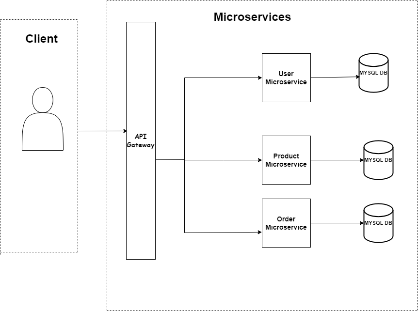

# Online Store Web App

## Overview

This is an Online Store web application built with a microservices architecture using Spring Boot, REST API, and Docker. The application consists of three main microservices: User Service, Product Service, and Order Service.

## System Architecture



## Technologies Used

- Java 17
- Spring Boot
- Spring Security (JWT)
- Maven
- Docker

## Microservices Instance

### User Service

**Responsibilities**: Manages user authentication and authorization.

**Endpoints , Port : 9090**:
```http
POST users/auth/register
POST users/auth/login
GET /users/{id}
